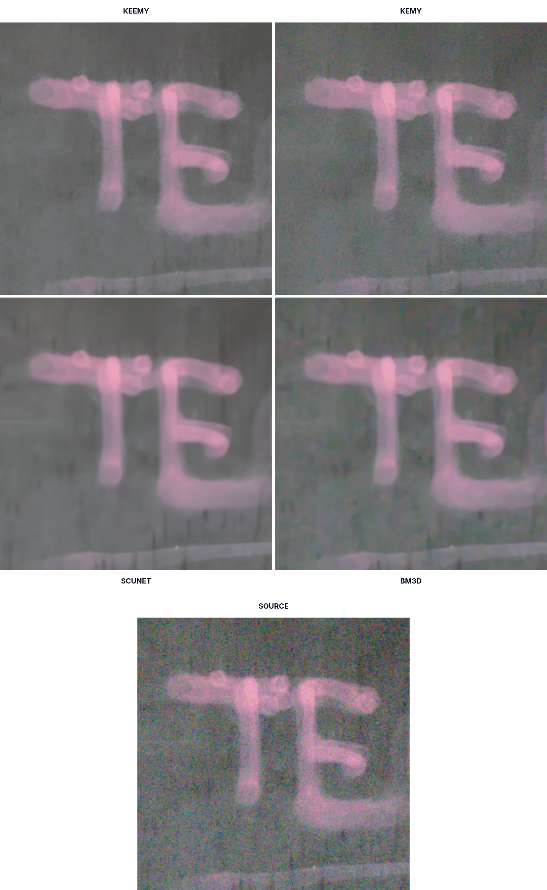

# KEEMY

**KEEMY** (**K**entucky **E**fficient **E**rror **M**odeler) is a fast blind image denoiser developed at the University of Kentucky’s KAOS Research Lab. It is an improved version of KEMY, sharing the same self-derived statistical error model while improving runtime and denoising quality through more efficient patch correspondence and reconstruction.

### Why Use KEEMY
Most traditional image denoisers rely on explicit noise assumptions (e.g., Gaussian noise models) or are trained on fixed distributions, which limits their robustness when encountering real-world or mixed noise sources such as Poisson noise, shot noise, or sensor-dependent artifacts.

KEEMY is a blind denoiser that requires no prior training or fixed noise models. Instead, it generates a probabilistic pixel value error model directly from the image being processed. By using local texture statistics to determine the likelihood of noise versus true detail, it can adapt to extreme conditions and perform "credible repair" without the hallucinations or massive hardware requirements of deep learning methods.

## Performance

Compared to the original KEMY implementation on the benchmark DPReview image, KEEMY achieves:

- **5.0× faster** multithreaded performance
- **7.8× faster** single-threaded performance
- **1.37× faster** single-threaded execution than multithreaded KEMY

Below is a cropped image comparison from the [project writeup](https://eiron.xyz/keemy/):

<p align="center">
  
</p>

## Documentation

The full KEEMY writeup includes implementation details, benchmarking results, image comparisons, denoising pipeline explanations, along with background information for those without prior experience in image processing.

* [KEEMY writeup](https://eiron.xyz/keemy/)  
* [Original KEMY project](https://aggregate.org/DIT/KEMY/)
* [Paper on Error Models](https://aggregate.org/DIT/ERRPDF/)

## Dependencies

- **OpenCV 4** (primarily used for image I/O)

## Compilation

The provided `Makefile` builds separate binaries for color and grayscale denoising.

### Color image denoising

```
make keemy
```

### Grayscale Image Denoising
```
make keemy_gray
```

### Manual Compilation
`COLORS` specifies the number of color channels.

```
g++ -O3 keemy.cpp -DCOLORS=3 -o keemy `pkg-config --cflags --libs opencv4`
```

## Usage
The default parameters work well for general-purpose denoising, though heavier noise levels typically benefit from tuning.
```
./keemy <input> [output] [passes] [simThresh]
```

### Parameters

#### Compile-Time
This should be tuned first as it directly affects the runtime parameters.

| Parameter | Default | Recommended | Effect |
| :--- | :---: | :---: | :--- |
| `K_MAX` | `40` | `30–80` | The number of similar patches stored per-pixel. Higher values generally improve denoising quality at the cost of increased memory usage and runtime. However, setting `K_MAX` too high can over smooth the image. |

#### CLI Runtime
| Parameter  | Default | Recommended | Effect |
| :--------- | :-----: | :---------: | :----- |
| `passes`   |   `2`   |    `1–5`    | Number of denoising iterations. Higher values increase smoothness, but excessive passes may cause posterization. |
| `simThresh`| `0.00`* | `0.00–0.06` | \*Set to `0.00` for no pruning. Threshold used to prune weak patch correspondences. Higher values better preserve fine detail, but may retain more noise. |

